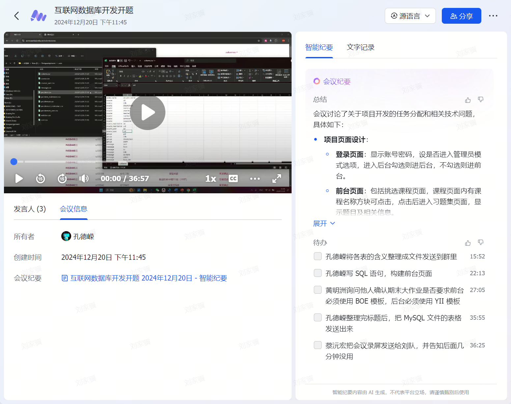
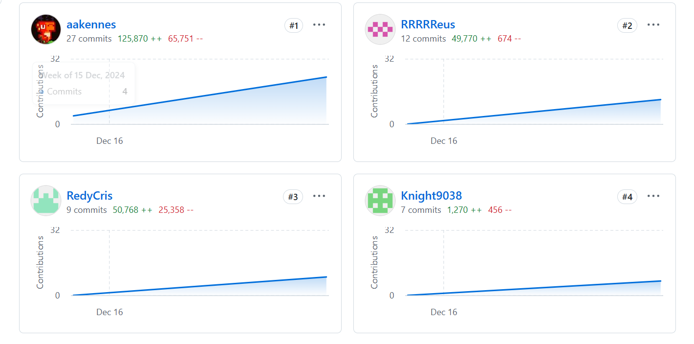
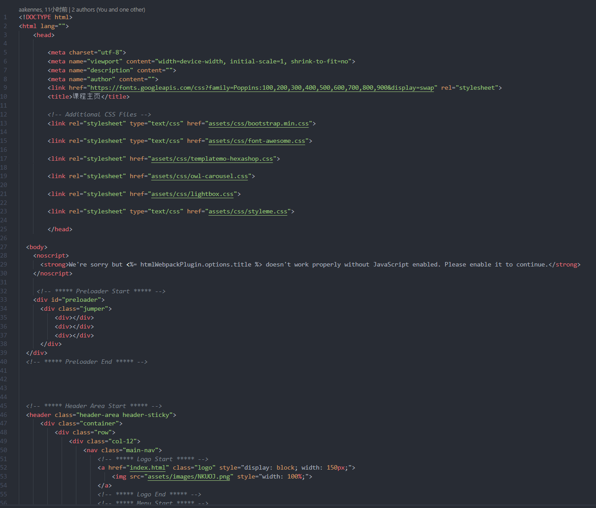

# 任务分工过程



项目前期由组长孔德嵘组织飞书会议，确定这次大作业的主题为：NKUOJ界面及其数据可视化。并确定了项目使用**node.js**作为登陆页面、**vue.js**和**node.js**作为前台框架，**yii2**和**php**作为后台框架。

会议具体分工如下：

首先由孔德嵘处理数据，建立和维护数据库

## 前台

##### 2213626孔德嵘

+ 登录页面
+ 个人页面前后端
+ 前后台连接
+ 习题集、习题列表页面同课程用户查看

##### 2211437刘家骥

+ 课程页面前后端
+ 习题集页面前后端
+ 习题列表页面前后端
+ 习题详情页面前后端

## 后台

##### 2213897蔡沅宏

+ index 1/2/3页面编写
+ 实现php页面展示和跳转逻辑
+ index 1/2页面数据可视化交互
+ models构建、controller逻辑实现数据库增删改查逻辑
+ login页面与后台连接

##### 2211804黄明州

+ index 1/2/3页面编写
+ index 1/3页面数据可视化交互
+ models构建、controller逻辑实现数据库增删改查逻辑

# Git提交记录

团队使用`GitHub`作为代码管理工具，仓库地址为：[WebDataBase](https://github.com/aakennes/WebDataBase.git)


# 主要代码及目录展示

## 目录展示

*记得更新最新的项目目录*

## 前台主要代码

### 1. 前台前端

前台使用vue.js作为前端框架，后端采用node.js框架

前端代码主要负责静态内容的展示，以及从后端获取数据，填充页面。

在Vue框架中

+ Vue：位于src目录下。专注于视图层，包含了组件的模板（HTML）、脚本（JavaScript）和样式（CSS）。template主要用于展示内容；script负责处理逻辑部分，用于定义组件的逻辑和行为。Vue组件的脚本部分通常包含组件的数据、方法、生命周期钩子等。通过JavaScript，可以处理用户交互、操作数据、调用API等；style定义了template部分的html风格形式，即个性化参数

+ HTML：位于public目录下。HTML主要展示网页中静态的内容。定义了应用的基本结构，并包含一个`<div id="app"></div>`，Vue应用会挂载到这个元素上

+ js：通常位于src目录下。用于创建Vue实例，并将应用挂载到index.html中的`<div id="app"></div>`元素上。


**以课程页为例**

js代码将index.vue挂载到index.html中的`<div id="app"></div>`元素上
```js
import { createApp } from 'vue';
import Index from '@/pages/index.vue'; // 引入首页组件

// 从 window 中获取 uid
const uid = window.uid;

createApp(Index, { uid }).mount('#app');
```

vue代码包含组件的模板（HTML）、脚本（JavaScript）和样式（CSS）
```js
<template>

  <div class="container">
    <!-- 我的课程部分 -->
    <div v-if="courses.length > 0" class="section">
      <h3>我的课程</h3>
      <div class="courses-grid">
        <div v-for="course in courses" :key="course.cid" class="card">
          <a :href="`ProblemSet.html?uid=${uid}&cid=${course.cid}`" class="title">{{ course.title }}</a>
          <a :href="`ProblemSet.html?uid=${uid}&cid=${course.cid}`" class="description">{{ course.description }}</a>
          <button v-if="course.status === '未加入'" class="btn btn-primary">加入课程</button>
          <p v-else>已加入</p>
        </div>
      </div>
    </div>
  </div>

</template>
  
<script>
  export default {
    name: 'HomePage',
    props: ['uid'],  // 接收从外部传入的 uid
  data() {
    return {
      courses: [] // 课程数据
    };
  },
  created() {
    this.fetchCourses(); // 页面加载时获取课程数据
  },
  methods: {
   // 从后端获取课程数据
   async fetchCourses() {
      try {
        const response = await fetch(`http://localhost:3000/api/courses?uid=${this.uid}`);
        console.log("!!!!!!!!!!!!!!!!!!!!!!!!!!!!!!!",this.uid);
        if (!response.ok) {
          throw new Error(`HTTP error! status: ${response.status}`);
        }
        const data = await response.json();
        this.courses = data || []; // 更新课程数据
      } catch (error) {
        console.error('获取课程数据失败:', error);
      }
    },
    mounted() {
    // 动态加载 custom.js
      const script = document.createElement("script");
      script.src = "assets/js/custom.js";
      script.defer = true;
      document.body.appendChild(script);
    },

    }
  };
</script>
  
  <style scoped>
.container {
  background-color: #f8f9fa;
  margin: 120px auto;
  max-width: 1000px;
  padding: 30px; 
  border-radius: 10px;
}
.section {
  margin-bottom: 30px;
}

.courses-grid {
  display: grid;
  grid-template-columns: repeat(2, 1fr); /* 两列布局 */
  gap: 20px; /* 每个卡片之间的间距 */
}

.card {
  padding: 15px;
  border: 1px solid #ddd;
  border-radius: 5px;
  box-shadow: 0 2px 5px rgba(0, 0, 0, 0.1);
}
.card .title {
  font-size: 1.1em; /* 增大字体大小 */
  font-weight: bold; /* 加粗字体 */
  margin-bottom: 10px; /* 增加与描述之间的间距 */
}
.card .description {
  font-size: 0.8em; /* 减小字体大小 */
  color: #7e7e7e; /* 设置较浅的颜色 */
}
.btn {
  padding: 10px 15px;
  border-radius: 5px;
  cursor: pointer;
}
.btn-primary {
  background-color: #007bff;
  color: white;
  border: none;
}
.btn-secondary {
  background-color: #979da3;
  color: white;
  border: none;
}
  </style>
  
```

其中与后端的交互在script中,通过`http://localhost:3000/api/courses?uid=${this.uid}`读取数据
```js
 // 从后端获取课程数据
   async fetchCourses() {
      try {
        const response = await fetch(`http://localhost:3000/api/courses?uid=${this.uid}`);
        console.log("!!!!!!!!!!!!!!!!!!!!!!!!!!!!!!!",this.uid);
        if (!response.ok) {
          throw new Error(`HTTP error! status: ${response.status}`);
        }
        const data = await response.json();
        this.courses = data || []; // 更新课程数据
      } catch (error) {
        console.error('获取课程数据失败:', error);
      }
    }
```


html代码主要展示静态部分内容，并获取登录页传来的uid等用户信息



### 2. 前台后端
后端连接数据库进行查询，将读取到的数据传给前端进行展示

主要实现在server.js中,同构构建sql语句进行查询，将结果信息返回到后端3000端口上

```js
// API 路由：根据 uid 获取用户课程数据
app.get('/api/courses', (req, res) => {
    const { uid } = req.query;  // 获取前端传递的 uid

    // 确保传递了 uid
    if (!uid) {
      return res.status(400).send('uid is required');
    }
  
    // 查询数据库获取与 uid 相关的课程数据
    const query =  `
    SELECT 
        c.cid,
        c.title,
        c.description,
        c.owner_id,
        c.passcode,
        c.number
    FROM 
        course_user cu
    JOIN 
        course c ON cu.cid = c.cid
    WHERE 
        cu.uid = ?
    
    `;
    
    db.execute(query, [uid], (err, results) => {
      if (err) {
        return res.status(500).send('Database query failed');
      }

    // console.log("根据 uid 获取用户课程数据", results);
  
      if (results.length > 0) {
        res.json(results);  // 返回查询结果
      } else {
        res.status(404).send('No courses found for this uid');
      }
    });
});
```


## 后台主要代码

### 1. 后台实现与login页面相连
```php
// 从 URL 中提取 uid
        $uid = Yii::$app->request->get('uid', null);

        // 如果 URL 中提供了 uid，保存到 session
        if ($uid !== null) {
            Yii::$app->session->set('uid', $uid);
        }
        
        // 从 session 中获取 uid
        $sessionUid = Yii::$app->session->get('uid', null);
        
        // 如果 session 中没有 uid，则抛出异常
        if ($sessionUid === null) {
            throw new \yii\web\BadRequestHttpException('无法找到有效的 UID');
        }

        $uid = $sessionUid;
```

### 2. 实现views页面
#### 建立新asset
```php
<?php

namespace app\assets;

use yii\web\AssetBundle;

class AdminLteAsset extends AssetBundle
{
    public $basePath = '@webroot'; // 指向 web 目录
    public $baseUrl = '@web/adminlte'; // 指向 adminlte 目录
    public $css = [
        'css/adminlte.css', // AdminLTE 核心样式
    ];
    public $depends = [
        'yii\web\YiiAsset',
        'yii\bootstrap5\BootstrapAsset',
    ];
}
```

#### 三个index页面

主页面将会自动选择index.php页面展示，三个页面利用`href="<?= Url::to(['site/index']) ?>`这样的逻辑实现相互之间跳转。

页面代码详见backend/views

### 3. 增删改查逻辑实现
#### Models
利用models与数据库中的表建立联系。

models详情可见backend/models

#### Controllers
利用controller处理交互逻辑，controller利用model完成对数据库的增删改查操作。

以index页面的函数为例：

```php
public function actionIndex()
    {
        // 从 URL 中提取 uid
        $uid = Yii::$app->request->get('uid', null);

        // 如果 URL 中提供了 uid，保存到 session
        if ($uid !== null) {
            Yii::$app->session->set('uid', $uid);
        }
        
        // 从 session 中获取 uid
        $sessionUid = Yii::$app->session->get('uid', null);
        
        // 如果 session 中没有 uid，则抛出异常
        if ($sessionUid === null) {
            throw new \yii\web\BadRequestHttpException('无法找到有效的 UID');
        }

        $uid = $sessionUid;


        $username = User::find()
            ->select(['nickname'])  // 选择 nickname 字段
            ->where(['uid' => $uid]) // 根据 uid 查询
            ->scalar(); // 返回单个字段值


        // 查询该用户创建的最新题目的 pid
        $latestProblem = ProblemMaintainer::find()
            ->where(['uid' => $uid])
            ->orderBy(['pid' => SORT_DESC]) // 按 pid 降序排列
            ->one();
        
        //上方栏数据
        $submitAllCount = 0;
        $submitac = 0;
        $accuracy = 0;
        $passstu = 0;
        $allsubmit = 0;

        if ($latestProblem) {
            // 根据最新的 pid 查询 problem 表的 submit_all
            $problem = Problem::find()
                ->where(['pid' => $latestProblem->pid])
                ->one();

            if ($problem) {
                $submitAllCount = $problem->submit_all;
            }
        }

        if ($latestProblem) {
            // 根据最新的 pid 查询 problem 表的 submit_all
            $problem = Problem::find()
                ->where(['pid' => $latestProblem->pid])
                ->one();

            if ($problem) {
                $submitAllCount = $problem->submit_all;
                $submitac = $problem->submit_ac;
                $accuracy = round(($submitac / $submitAllCount)*100);

                // 计算通过人数 passstu
                $passstu = Solution::find()
                    ->select(['uid']) // 只查询 uid 列
                    ->where(['pid' => $latestProblem->pid, 'score' => 100]) // 查询通过的提交
                    ->distinct() // 去重
                    ->count(); // 统计人数
                $allsubmit = Solution::find()
                    ->select(['uid']) // 只查询 uid 列
                    ->where(['pid' => $latestProblem->pid]) // 查询通过的提交
                    ->distinct() // 去重
                    ->count(); // 统计人数
            }
        }


        // 查询有提交记录的最近 7 天数据并按日期分组
        $results = Solution::find()
        ->select([
            'submission_date' => 'DATE(`when`)',  // 提交日期
            'total_submissions' => 'COUNT(*)', // 总提交次数
            'passed_submissions' => 'SUM(CASE WHEN score = 100 THEN 1 ELSE 0 END)', // 通过次数
        ])
        ->where(['pid' => $latestProblem->pid])
        ->groupBy(['submission_date'])
        ->orderBy(['submission_date' => SORT_DESC]) // 按日期倒序排列
        ->limit(7) // 只取最近 7 天有提交记录的数据
        ->asArray()        // 返回数组形式
        ->all();

        // 构造每天的提交次数数组和通过次数数组
        $dates = [];
        $totalSubmissions = [];
        $passedSubmissions = [];

        // 填充结果
        foreach ($results as $result) {
        $dates[] = $result['submission_date'];
        $totalSubmissions[] = $result['total_submissions'];
        $passedSubmissions[] = $result['passed_submissions'];
        }

        // 按日期升序排序（因为查询结果是倒序）
        $dates = array_reverse($dates);
        $totalSubmissions = array_reverse($totalSubmissions);
        $passedSubmissions = array_reverse($passedSubmissions);


        // 将结果传递给视图
        return $this->render('index', [
            'username'=>$username,
            'submitAllCount' => $submitAllCount,
            'accuracy' => $accuracy,
            'passstu' => $passstu,
            'allsubmit' => $allsubmit,
            'dates' => $dates,
            'total_submissions' => $totalSubmissions,
            'passed_submissions' => $passedSubmissions,
            'username' => $username,
        ]);
    }
```

利用controller实现数据查找等操作，然后返回index页面进行动态渲染。